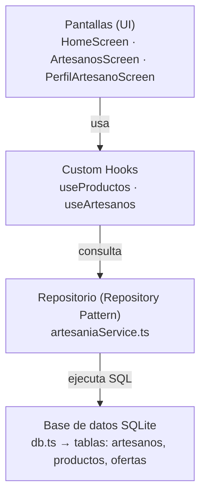

# Artisan Auction — Proyecto Integrador

**Programación Móvil · Universidad Politécnica de Querétaro · Mayo–Agosto 2026**
Ingeniería en Sistemas Computacionales · 9.° Cuatrimestre

---

## Descripción

Aplicación móvil de subastas de artesanías mexicanas desarrollada en React Native con Expo. El proyecto demuestra la implementación de patrones de diseño profesionales aplicados a una app funcional que consume datos de artesanos y productos en subasta.

---

## Tecnologías

- React Native
- Expo SDK 54
- TypeScript
- React Navigation v6

---

## Requisitos previos

- Node.js instalado
- Expo Go instalado en el celular (versión SDK 54)
- VS Code

---

## Instalación

```bash
git clone https://github.com/BOWadapter/PM.git
cd PM
npm install
npx expo start --clear
```

Escanea el QR con Expo Go desde tu celular.

---

## Estructura del proyecto

```
mi-proyecto-nuevo/
├── App.tsx                     ← Navegación principal
├── index.ts                    ← Punto de entrada
├── src/
│   ├── screens/
│   │   ├── HomeScreen.tsx      ← Lista de subastas con interacción
│   │   └── PerfilScreen.tsx    ← Perfil del usuario
│   ├── components/             ← (próximamente)
│   ├── services/
│   │   └── artesaniaService.ts ← Datos de artesanos y productos
│   ├── hooks/
│   │   └── useProductos.ts     ← Custom Hook de carga de datos
│   └── types/
│       └── index.ts            ← Tipos TypeScript del dominio
├── assets/
├── package.json
└── tsconfig.json
```

---

## Patrones de diseño implementados

### 1. Separation of Concerns

Cada carpeta tiene una única responsabilidad:

| Carpeta | Responsabilidad |
|---|---|
| `screens/` | Mostrar la interfaz al usuario |
| `services/` | Proveer y centralizar los datos |
| `types/` | Definir las estructuras de datos |
| `components/` | Piezas visuales reutilizables |
| `hooks/` | Lógica reutilizable entre pantallas |

### 2. Repository Pattern

`artesaniaService.ts` centraliza todos los datos en un solo lugar. Cuando conectemos la API real, solo modificamos este archivo y el resto de la app no cambia.

### 3. Custom Hooks

`useProductos.ts` encapsula la lógica de obtención de datos y el estado de carga, separándola de la pantalla. `HomeScreen` ya no sabe de dónde vienen los datos: solo consume el hook. Cuando se conecte la API real, únicamente cambia el hook.

---

## Tipos TypeScript — `src/types/index.ts`

```ts
export type Artesano = {
  id: number;
  nombre: string;
  especialidad: string;
  imagen: string;
  ubicacion: string;
};

export type Producto = {
  id: number;
  nombre: string;
  descripcion: string;
  imagen: string;
  precioInicial: number;
  precioActual: number;
  artesanoId: number;
  fechaFin: string;
};

export type Oferta = {
  id: number;
  productoId: number;
  usuarioId: number;
  monto: number;
  fecha: string;
};
```

---

## Datos de prueba — `src/services/artesaniaService.ts`

```ts
import { Artesano, Producto } from '../types/index';

export const artesanos: Artesano[] = [
  {
    id: 1,
    nombre: 'María López',
    especialidad: 'Cerámica Talavera',
    imagen: 'https://picsum.photos/id/1011/200',
    ubicacion: 'Puebla, México',
  },
  {
    id: 2,
    nombre: 'Juan Méndez',
    especialidad: 'Textiles Otomí',
    imagen: 'https://picsum.photos/id/1012/200',
    ubicacion: 'Querétaro, México',
  },
  {
    id: 3,
    nombre: 'Rosa Hernández',
    especialidad: 'Alebrijes',
    imagen: 'https://picsum.photos/id/1013/200',
    ubicacion: 'Oaxaca, México',
  },
];

export const productos: Producto[] = [
  {
    id: 1,
    nombre: 'Jarrón Talavera Azul',
    descripcion: 'Jarrón hecho a mano con técnica tradicional de Talavera.',
    imagen: 'https://picsum.photos/id/200/300',
    precioInicial: 500,
    precioActual: 650,
    artesanoId: 1,
    fechaFin: '2026-07-01',
  },
  {
    id: 2,
    nombre: 'Mantel Bordado Otomí',
    descripcion: 'Mantel con bordado a mano con motivos de la cultura Otomí.',
    imagen: 'https://picsum.photos/id/201/300',
    precioInicial: 800,
    precioActual: 950,
    artesanoId: 2,
    fechaFin: '2026-07-05',
  },
  {
    id: 3,
    nombre: 'Alebrije Dragón',
    descripcion: 'Figura de madera pintada a mano representando un dragón.',
    imagen: 'https://picsum.photos/id/202/300',
    precioInicial: 1200,
    precioActual: 1200,
    artesanoId: 3,
    fechaFin: '2026-07-10',
  },
];
```

---

## Custom Hook — `src/hooks/useProductos.ts`

```ts
import { useState, useEffect } from 'react';
import { productos as productosMock, artesanos } from '../services/artesaniaService';
import { Producto, Artesano } from '../types/index';

export function useProductos() {
  const [productos, setProductos] = useState<Producto[]>([]);
  const [cargando, setCargando] = useState<boolean>(true);

  useEffect(() => {
    setProductos(productosMock);
    setCargando(false);
  }, []);

  const getArtesano = (artesanoId: number): Artesano | undefined => {
    return artesanos.find(a => a.id === artesanoId);
  };

  return { productos, cargando, getArtesano };
}
```

---

## Pantalla principal — `src/screens/HomeScreen.tsx`

```tsx
import { View, Text, StyleSheet, FlatList, Image, TouchableOpacity, Alert, ActivityIndicator } from 'react-native';
import { useProductos } from '../hooks/useProductos';
import { Producto } from '../types/index';

export default function HomeScreen() {
  const { productos, cargando, getArtesano } = useProductos();

  const handleOfertar = (producto: Producto) => {
    const nuevaOferta = producto.precioActual + 100;
    Alert.alert(
      'Confirmar oferta',
      `¿Deseas ofertar $${nuevaOferta} por ${producto.nombre}?`,
      [
        { text: 'Cancelar', style: 'cancel' },
        { text: 'Ofertar', onPress: () => Alert.alert('Oferta enviada', `Tu oferta de $${nuevaOferta} fue registrada.`) },
      ]
    );
  };

  const renderProducto = ({ item }: { item: Producto }) => {
    const artesano = getArtesano(item.artesanoId);
    return (
      <View style={styles.card}>
        <Image source={{ uri: item.imagen }} style={styles.imagen} />
        <View style={styles.info}>
          <Text style={styles.nombre}>{item.nombre}</Text>
          <Text style={styles.artesano}>{artesano?.nombre} · {artesano?.ubicacion}</Text>
          <Text style={styles.descripcion}>{item.descripcion}</Text>
          <View style={styles.precios}>
            <Text style={styles.precioLabel}>Precio actual:</Text>
            <Text style={styles.precio}>${item.precioActual}</Text>
          </View>
          <Text style={styles.fecha}>Cierra: {item.fechaFin}</Text>
          <TouchableOpacity style={styles.boton} onPress={() => handleOfertar(item)}>
            <Text style={styles.botonTexto}>Hacer oferta +$100</Text>
          </TouchableOpacity>
        </View>
      </View>
    );
  };

  if (cargando) {
    return (
      <View style={styles.centrado}>
        <ActivityIndicator size="large" color="#3b82f6" />
        <Text style={styles.cargandoTexto}>Cargando subastas...</Text>
      </View>
    );
  }

  return (
    <View style={styles.container}>
      <FlatList
        data={productos}
        keyExtractor={item => item.id.toString()}
        renderItem={renderProducto}
        contentContainerStyle={styles.lista}
      />
    </View>
  );
}

const styles = StyleSheet.create({
  container: { flex: 1, backgroundColor: '#f5f5f5' },
  centrado: { flex: 1, alignItems: 'center', justifyContent: 'center', backgroundColor: '#f5f5f5' },
  cargandoTexto: { marginTop: 12, fontSize: 14, color: '#666' },
  lista: { padding: 16, gap: 16 },
  card: { backgroundColor: '#fff', borderRadius: 12, overflow: 'hidden', elevation: 3 },
  imagen: { width: '100%', height: 180 },
  info: { padding: 12, gap: 6 },
  nombre: { fontSize: 18, fontWeight: 'bold', color: '#1a1a1a' },
  artesano: { fontSize: 13, color: '#888' },
  descripcion: { fontSize: 14, color: '#555' },
  precios: { flexDirection: 'row', alignItems: 'center', gap: 8, marginTop: 4 },
  precioLabel: { fontSize: 14, color: '#555' },
  precio: { fontSize: 20, fontWeight: 'bold', color: '#3b82f6' },
  fecha: { fontSize: 12, color: '#aaa' },
  boton: { backgroundColor: '#3b82f6', borderRadius: 8, paddingVertical: 10, alignItems: 'center', marginTop: 8 },
  botonTexto: { color: '#fff', fontWeight: 'bold', fontSize: 15 },
});
```

---

## Navegación — `App.tsx`

```tsx
import { NavigationContainer } from '@react-navigation/native';
import { createBottomTabNavigator } from '@react-navigation/bottom-tabs';
import { Text } from 'react-native';
import HomeScreen from './src/screens/HomeScreen';
import PerfilScreen from './src/screens/PerfilScreen';

const Tab = createBottomTabNavigator();

export default function App() {
  return (
    <NavigationContainer>
      <Tab.Navigator>
        <Tab.Screen
          name="Inicio"
          component={HomeScreen}
          options={{ tabBarIcon: () => <Text>🏠</Text> }}
        />
        <Tab.Screen
          name="Perfil"
          component={PerfilScreen}
          options={{ tabBarIcon: () => <Text>👤</Text> }}
        />
      </Tab.Navigator>
    </NavigationContainer>
  );
}
```

---

## Componentes React Native utilizados

| Componente | Función |
|---|---|
| `FlatList` | Lista optimizada que solo renderiza elementos visibles |
| `TouchableOpacity` | Interacción táctil con retroalimentación visual |
| `Alert` | Diálogos nativos de confirmación |
| `Image` | Carga de imágenes desde URL |
| `ActivityIndicator` | Spinner de carga mientras se obtienen los datos |


# Custom Hooks en React Native

**Programación Móvil · Universidad Politécnica de Querétaro · Mayo–Agosto 2026**

---

## ¿Qué es un Custom Hook?

Un Custom Hook es una función de JavaScript cuyo nombre empieza con `use` y que permite **reutilizar lógica de estado** entre varios componentes. En lugar de repetir el mismo código (cargar datos, manejar un estado de carga, calcular valores) en cada pantalla, ese comportamiento se extrae a una función independiente que cualquier componente puede invocar.

Es importante entender que un Custom Hook **no devuelve interfaz** (no retorna JSX): devuelve datos y funciones. La pantalla se encarga de mostrar; el hook se encarga de la lógica.

---

## ¿Por qué usarlos?

En el proyecto Artisan Auction, la pantalla `HomeScreen` originalmente importaba los datos directamente y se encargaba de todo: obtener los productos, buscar el artesano de cada uno y mostrarlos. Esto mezcla dos responsabilidades distintas en un solo archivo.

Al mover la lógica de datos a un Custom Hook conseguimos:

- **Separación de responsabilidades:** la pantalla solo muestra; el hook gestiona los datos.
- **Reutilización:** si otra pantalla necesita los mismos productos, llama al mismo hook.
- **Mantenibilidad:** cuando se conecte la API real, solo se modifica el hook, no las pantallas.
- **Legibilidad:** la pantalla queda más corta y fácil de leer.

---

## Implementación — `src/hooks/useProductos.ts`

```ts
import { useState, useEffect } from 'react';
import { productos as productosMock, artesanos } from '../services/artesaniaService';
import { Producto, Artesano } from '../types/index';

export function useProductos() {
  const [productos, setProductos] = useState<Producto[]>([]);
  const [cargando, setCargando] = useState<boolean>(true);

  useEffect(() => {
    setProductos(productosMock);
    setCargando(false);
  }, []);

  const getArtesano = (artesanoId: number): Artesano | undefined => {
    return artesanos.find(a => a.id === artesanoId);
  };

  return { productos, cargando, getArtesano };
}
```

---

## Análisis del código

El hook utiliza dos Hooks nativos de React:

**`useState`** crea variables de estado. Aquí se declaran dos: `productos` (la lista que se mostrará, inicia vacía) y `cargando` (un booleano que indica si los datos aún se están obteniendo, inicia en `true`). Cada vez que se actualiza un estado con su función `set`, el componente que usa el hook se vuelve a renderizar.

**`useEffect`** ejecuta código en momentos específicos del ciclo de vida del componente. El arreglo vacío `[]` al final indica que el efecto se ejecuta **una sola vez**, cuando el componente se monta. Dentro se cargan los datos de prueba y se cambia `cargando` a `false`. Más adelante, este es el punto donde se hará la petición a la API real.

**`getArtesano`** es una función auxiliar que, dado el `artesanoId` de un producto, devuelve el objeto completo del artesano. Se incluye en el hook porque es lógica relacionada con los datos.

Finalmente, el hook **retorna un objeto** con `productos`, `cargando` y `getArtesano`. Eso es lo que la pantalla recibirá al llamarlo.

---

## Uso en la pantalla

La pantalla consume el hook con una sola línea, usando desestructuración:

```tsx
const { productos, cargando, getArtesano } = useProductos();
```

A partir de ahí, `HomeScreen` ya no sabe de dónde vienen los datos ni cómo se cargan. Solo los usa. Además, aprovecha el estado `cargando` para mostrar un indicador mientras los datos no están listos:

```tsx
if (cargando) {
  return (
    <View style={styles.centrado}>
      <ActivityIndicator size="large" color="#3b82f6" />
      <Text>Cargando subastas...</Text>
    </View>
  );
}
```

---

## Reglas de los Hooks

Para que los Hooks funcionen correctamente, React establece dos reglas:

1. **Solo se llaman en el nivel superior** de un componente o de otro Hook. Nunca dentro de condicionales, bucles o funciones anidadas.
2. **Solo se llaman desde componentes de React o desde otros Custom Hooks.** No desde funciones de JavaScript comunes.

La convención del prefijo `use` no es decorativa: es lo que permite a las herramientas de desarrollo verificar que estas reglas se cumplan.

---

## Conexión con los patrones de diseño del proyecto

Este Custom Hook es la tercera pieza del esquema de patrones del proyecto Artisan Auction:

| Patrón | Archivo | Responsabilidad |
|---|---|---|
| Separation of Concerns | estructura `src/` | Cada carpeta una responsabilidad |
| Repository Pattern | `services/artesaniaService.ts` | Centralizar el origen de los datos |
| Custom Hooks | `hooks/useProductos.ts` | Encapsular la lógica de datos y estado |

Juntos logran que la capa de datos, la lógica y la presentación estén separadas, que es el objetivo de una arquitectura mantenible.

---

# Conexión a SQLite y módulo "Perfil de Artesano"

**Programación Móvil (UPQDPEFO002) · Universidad Politécnica de Querétaro**
**Periodo Mayo–Agosto 2026 · Unidad II — Diseño de aplicaciones móviles**
**Proyecto integrador: Artisan Auction · React Native + Expo SDK 54**

---

## 1. ¿Qué vamos a construir?

Hasta ahora los datos de la app vivían **en memoria** (arreglos dentro de `artesaniaService.ts`). Eso significa que se recargan cada vez que abres la app y no hay forma de guardarlos.

En este avance hacemos dos cosas:

1. **Conectamos una base de datos SQLite local** en el dispositivo con `expo-sqlite`. Los datos pasan a vivir en una base de datos real, con tablas y consultas SQL.
2. **Agregamos un módulo nuevo:** el **perfil de cada artesano**, donde se ve su información y las piezas que tiene en subasta.

Lo importante no es solo "usar una base de datos", sino hacerlo **bien organizado**. Por eso seguimos tres patrones de diseño que ya veníamos trabajando: Separation of Concerns, Repository Pattern y Custom Hooks.

---

## 2. Arquitectura en 4 capas

La app se organiza en cuatro capas. **Cada capa solo conoce a la de abajo**: una pantalla nunca habla directamente con SQLite, sino que pide los datos a un hook, el hook al repositorio, y solo el repositorio sabe que por debajo hay una base de datos.



> Las llamadas **bajan** (la pantalla pide datos) y los datos **regresan** por el mismo camino hacia arriba.

| Capa | Archivo(s) | Responsabilidad |
|------|-----------|-----------------|
| **Pantallas** | `src/screens/` | Mostrar la interfaz y reaccionar al usuario. No saben de dónde vienen los datos. |
| **Custom Hooks** | `src/hooks/` | Encapsular la lógica de estado (`useState`, `useEffect`) y pedir los datos al repositorio. |
| **Repositorio** | `src/services/artesaniaService.ts` | Único punto que sabe consultar la base de datos. Expone funciones como `obtenerArtesanos()`. |
| **Base de datos** | `src/database/db.ts` | Abrir la conexión SQLite, crear las tablas y sembrar los datos iniciales. |

**¿Por qué tanta separación?** Porque permite cambiar una capa sin romper las demás. En este avance cambiamos la fuente de datos (de arreglos en memoria a SQLite) y **las pantallas no necesitaron ni un cambio**. Ese es el objetivo del patrón.

---

## 3. Estructura de archivos (al terminar)

```
src/
├── database/
│   └── db.ts                      ← NUEVO: conexión + esquema + datos semilla
├── services/
│   └── artesaniaService.ts        ← MODIFICADO: ahora consulta SQLite (repositorio)
├── hooks/
│   ├── useProductos.ts            ← MODIFICADO: lee desde SQLite (misma API pública)
│   └── useArtesanos.ts            ← NUEVO: lista y detalle de artesanos
├── screens/
│   ├── HomeScreen.tsx             ← SIN CAMBIOS
│   ├── PerfilScreen.tsx           ← (perfil del usuario, ya existente)
│   ├── ArtesanosScreen.tsx        ← NUEVO: lista de artesanos
│   └── PerfilArtesanoScreen.tsx   ← NUEVO: perfil del artesano + sus piezas
├── types/
│   ├── index.ts                   ← tipos Artesano, Producto, Oferta (ya existente)
│   └── navigation.ts              ← NUEVO: tipos de navegación
└── App.tsx                        ← MODIFICADO: pestaña "Artesanos" con Stack anidado
```

---

## 4. Dependencias

```powershell
npx expo install expo-sqlite
npx expo install @react-navigation/native-stack
```

> Usa **`npx expo install`** (no `npm install`) para que Expo instale automáticamente las versiones compatibles con el SDK 54. `native-stack` reutiliza `react-native-screens` y `react-native-safe-area-context`, que ya estaban instalados para las pestañas.

---

## 5. Implementación paso a paso

### Paso 1 — Conexión y esquema SQLite

Crea `src/database/db.ts`. Aquí vive la conexión, la creación de las tablas y los **datos semilla** (los mismos que antes eran mock). La base de datos se abre **una sola vez** gracias a una promesa memorizada.

```ts
// src/database/db.ts
import * as SQLite from 'expo-sqlite';
import { Artesano, Producto } from '../types/index';

// ── Datos semilla (los mismos que ya teníamos como mock) ───────────────
const artesanosSemilla: Artesano[] = [
  { id: 1, nombre: 'María López',    especialidad: 'Cerámica Talavera', imagen: 'https://picsum.photos/id/1011/200', ubicacion: 'Puebla, México' },
  { id: 2, nombre: 'Juan Méndez',    especialidad: 'Textiles Otomí',    imagen: 'https://picsum.photos/id/1012/200', ubicacion: 'Querétaro, México' },
  { id: 3, nombre: 'Rosa Hernández', especialidad: 'Alebrijes',         imagen: 'https://picsum.photos/id/1013/200', ubicacion: 'Oaxaca, México' },
];

const productosSemilla: Producto[] = [
  { id: 1, nombre: 'Jarrón Talavera Azul', descripcion: 'Jarrón hecho a mano con técnica tradicional de Talavera.', imagen: 'https://picsum.photos/id/200/300', precioInicial: 500,  precioActual: 650,  artesanoId: 1, fechaFin: '2026-07-01' },
  { id: 2, nombre: 'Mantel Bordado Otomí', descripcion: 'Mantel con bordado a mano con motivos de la cultura Otomí.', imagen: 'https://picsum.photos/id/201/300', precioInicial: 800,  precioActual: 950,  artesanoId: 2, fechaFin: '2026-07-05' },
  { id: 3, nombre: 'Alebrije Dragón',      descripcion: 'Figura de madera pintada a mano representando un dragón.',  imagen: 'https://picsum.photos/id/202/300', precioInicial: 1200, precioActual: 1400, artesanoId: 3, fechaFin: '2026-07-08' },
];

// Promesa única: la BD se abre y prepara UNA sola vez en toda la app
let dbPromise: Promise<SQLite.SQLiteDatabase> | null = null;

export function getDatabase(): Promise<SQLite.SQLiteDatabase> {
  if (!dbPromise) {
    dbPromise = inicializar();
  }
  return dbPromise;
}

async function inicializar(): Promise<SQLite.SQLiteDatabase> {
  const db = await SQLite.openDatabaseAsync('artisan_auction.db');
  await crearTablas(db);
  await sembrarDatos(db);
  return db;
}

async function crearTablas(db: SQLite.SQLiteDatabase): Promise<void> {
  await db.execAsync(`
    PRAGMA journal_mode = WAL;
    PRAGMA foreign_keys = ON;

    CREATE TABLE IF NOT EXISTS artesanos (
      id           INTEGER PRIMARY KEY NOT NULL,
      nombre       TEXT    NOT NULL,
      especialidad TEXT,
      imagen       TEXT,
      ubicacion    TEXT
    );

    CREATE TABLE IF NOT EXISTS productos (
      id            INTEGER PRIMARY KEY NOT NULL,
      nombre        TEXT    NOT NULL,
      descripcion   TEXT,
      imagen        TEXT,
      precioInicial REAL,
      precioActual  REAL,
      artesanoId    INTEGER REFERENCES artesanos(id),
      fechaFin      TEXT
    );

    CREATE TABLE IF NOT EXISTS ofertas (
      id         INTEGER PRIMARY KEY AUTOINCREMENT,
      productoId INTEGER REFERENCES productos(id),
      usuarioId  INTEGER,
      monto      REAL,
      fecha      TEXT
    );
  `);
}

async function sembrarDatos(db: SQLite.SQLiteDatabase): Promise<void> {
  // Si ya hay artesanos, no volvemos a sembrar
  const fila = await db.getFirstAsync<{ total: number }>(
    'SELECT COUNT(*) AS total FROM artesanos'
  );
  if ((fila?.total ?? 0) > 0) return;

  for (const a of artesanosSemilla) {
    await db.runAsync(
      'INSERT INTO artesanos (id, nombre, especialidad, imagen, ubicacion) VALUES (?, ?, ?, ?, ?)',
      a.id, a.nombre, a.especialidad, a.imagen, a.ubicacion
    );
  }

  for (const p of productosSemilla) {
    await db.runAsync(
      'INSERT INTO productos (id, nombre, descripcion, imagen, precioInicial, precioActual, artesanoId, fechaFin) VALUES (?, ?, ?, ?, ?, ?, ?, ?)',
      p.id, p.nombre, p.descripcion, p.imagen, p.precioInicial, p.precioActual, p.artesanoId, p.fechaFin
    );
  }
}
```

**Qué aprender aquí:**
- `openDatabaseAsync` abre (o crea) el archivo de la base de datos.
- `execAsync` ejecuta varias sentencias SQL de golpe (ideal para crear tablas).
- `PRAGMA foreign_keys = ON` activa las llaves foráneas: `productos.artesanoId` apunta a `artesanos.id`.
- La función `sembrarDatos` solo inserta si la tabla está vacía, para no duplicar.
- La tabla `ofertas` queda lista para el futuro módulo de pujas (todavía no se usa).

### Paso 2 — Repositorio (Repository Pattern)

`artesaniaService.ts` deja de tener arreglos y pasa a ser el **repositorio**: el único archivo que sabe consultar SQLite.

```ts
// src/services/artesaniaService.ts
import { getDatabase } from '../database/db';
import { Artesano, Producto } from '../types/index';

// ── Artesanos ──────────────────────────────────────────────────────────
export async function obtenerArtesanos(): Promise<Artesano[]> {
  const db = await getDatabase();
  return db.getAllAsync<Artesano>('SELECT * FROM artesanos ORDER BY nombre');
}

export async function obtenerArtesanoPorId(id: number): Promise<Artesano | null> {
  const db = await getDatabase();
  return db.getFirstAsync<Artesano>('SELECT * FROM artesanos WHERE id = ?', id);
}

// ── Productos ──────────────────────────────────────────────────────────
export async function obtenerProductos(): Promise<Producto[]> {
  const db = await getDatabase();
  return db.getAllAsync<Producto>('SELECT * FROM productos');
}

export async function obtenerProductosPorArtesano(artesanoId: number): Promise<Producto[]> {
  const db = await getDatabase();
  return db.getAllAsync<Producto>(
    'SELECT * FROM productos WHERE artesanoId = ?',
    artesanoId
  );
}
```

**Qué aprender aquí:**
- `getAllAsync<T>(sql)` devuelve un arreglo de filas tipado como `T[]`.
- `getFirstAsync<T>(sql, param)` devuelve la primera fila o `null`.
- El `?` es un **parámetro**: evita errores y problemas de seguridad (nunca concatenes valores directo en el SQL).

### Paso 3 — Hook de productos (actualizar)

El hook ahora lee de SQLite, pero **expone exactamente la misma API** (`productos`, `cargando`, `getArtesano`). Por eso `HomeScreen.tsx` no cambia.

```ts
// src/hooks/useProductos.ts
import { useState, useEffect } from 'react';
import { obtenerProductos, obtenerArtesanos } from '../services/artesaniaService';
import { Producto, Artesano } from '../types/index';

export function useProductos() {
  const [productos, setProductos] = useState<Producto[]>([]);
  const [artesanos, setArtesanos] = useState<Artesano[]>([]);
  const [cargando, setCargando] = useState<boolean>(true);

  useEffect(() => {
    let activo = true; // evita actualizar estado si el componente se desmonta
    (async () => {
      const [prods, arts] = await Promise.all([obtenerProductos(), obtenerArtesanos()]);
      if (activo) {
        setProductos(prods);
        setArtesanos(arts);
        setCargando(false);
      }
    })();
    return () => { activo = false; };
  }, []);

  const getArtesano = (artesanoId: number): Artesano | undefined =>
    artesanos.find(a => a.id === artesanoId);

  return { productos, cargando, getArtesano };
}
```

**Qué aprender aquí:**
- `Promise.all` lanza las dos consultas en paralelo (más rápido que una tras otra).
- La bandera `activo` es buena práctica: si el usuario sale de la pantalla antes de que termine la consulta, no intentamos actualizar el estado de un componente que ya no existe.

### Paso 4 — Hook de artesanos (nuevo)

Dos hooks: uno para la lista y otro para un artesano con sus productos.

```ts
// src/hooks/useArtesanos.ts
import { useState, useEffect } from 'react';
import {
  obtenerArtesanos,
  obtenerArtesanoPorId,
  obtenerProductosPorArtesano,
} from '../services/artesaniaService';
import { Artesano, Producto } from '../types/index';

// Hook para la LISTA de artesanos
export function useArtesanos() {
  const [artesanos, setArtesanos] = useState<Artesano[]>([]);
  const [cargando, setCargando] = useState<boolean>(true);

  useEffect(() => {
    let activo = true;
    (async () => {
      const datos = await obtenerArtesanos();
      if (activo) { setArtesanos(datos); setCargando(false); }
    })();
    return () => { activo = false; };
  }, []);

  return { artesanos, cargando };
}

// Hook para UN artesano + sus productos en subasta
export function useArtesano(id: number) {
  const [artesano, setArtesano] = useState<Artesano | null>(null);
  const [productos, setProductos] = useState<Producto[]>([]);
  const [cargando, setCargando] = useState<boolean>(true);

  useEffect(() => {
    let activo = true;
    (async () => {
      const [a, p] = await Promise.all([
        obtenerArtesanoPorId(id),
        obtenerProductosPorArtesano(id),
      ]);
      if (activo) { setArtesano(a); setProductos(p); setCargando(false); }
    })();
    return () => { activo = false; };
  }, [id]);

  return { artesano, productos, cargando };
}
```

**Qué aprender aquí:** el segundo hook recibe un `id` y lo pone en el arreglo de dependencias de `useEffect` (`[id]`). Si el `id` cambia, el hook vuelve a consultar.

### Paso 5 — Tipos de navegación

```ts
// src/types/navigation.ts
export type ArtesanosStackParamList = {
  ListaArtesanos: undefined;
  PerfilArtesano: { artesanoId: number };
};
```

**Qué aprender aquí:** este tipo describe qué pantallas existen en el Stack y qué parámetros recibe cada una. `PerfilArtesano` exige un `artesanoId` de tipo `number`. Así TypeScript nos avisa si navegamos mal.

### Paso 6 — Pantalla lista de artesanos

```tsx
// src/screens/ArtesanosScreen.tsx
import { View, Text, StyleSheet, FlatList, Image, TouchableOpacity, ActivityIndicator } from 'react-native';
import { NativeStackScreenProps } from '@react-navigation/native-stack';
import { useArtesanos } from '../hooks/useArtesanos';
import { Artesano } from '../types/index';
import { ArtesanosStackParamList } from '../types/navigation';

type Props = NativeStackScreenProps<ArtesanosStackParamList, 'ListaArtesanos'>;

export default function ArtesanosScreen({ navigation }: Props) {
  const { artesanos, cargando } = useArtesanos();

  if (cargando) {
    return (
      <View style={styles.centrado}>
        <ActivityIndicator size="large" />
        <Text>Cargando artesanos...</Text>
      </View>
    );
  }

  const renderArtesano = ({ item }: { item: Artesano }) => (
    <TouchableOpacity
      style={styles.card}
      onPress={() => navigation.navigate('PerfilArtesano', { artesanoId: item.id })}
    >
      <Image source={{ uri: item.imagen }} style={styles.avatar} />
      <View style={styles.info}>
        <Text style={styles.nombre}>{item.nombre}</Text>
        <Text style={styles.especialidad}>{item.especialidad}</Text>
        <Text style={styles.ubicacion}>📍 {item.ubicacion}</Text>
      </View>
      <Text style={styles.flecha}>›</Text>
    </TouchableOpacity>
  );

  return (
    <FlatList
      data={artesanos}
      keyExtractor={(item) => item.id.toString()}
      renderItem={renderArtesano}
      contentContainerStyle={styles.lista}
    />
  );
}

const styles = StyleSheet.create({
  centrado: { flex: 1, justifyContent: 'center', alignItems: 'center', gap: 8 },
  lista: { padding: 12 },
  card: {
    flexDirection: 'row', alignItems: 'center', backgroundColor: '#fff',
    borderRadius: 12, padding: 12, marginBottom: 10, elevation: 2,
  },
  avatar: { width: 56, height: 56, borderRadius: 28, marginRight: 12 },
  info: { flex: 1 },
  nombre: { fontSize: 16, fontWeight: 'bold' },
  especialidad: { color: '#555' },
  ubicacion: { color: '#888', fontSize: 12, marginTop: 2 },
  flecha: { fontSize: 26, color: '#bbb' },
});
```

**Qué aprender aquí:** al tocar una tarjeta, `navigation.navigate('PerfilArtesano', { artesanoId: item.id })` abre la siguiente pantalla y le pasa el `id` del artesano como parámetro.

### Paso 7 — Pantalla perfil del artesano

Usa `ListHeaderComponent` para mostrar la ficha del artesano arriba y debajo su lista de piezas en subasta.

```tsx
// src/screens/PerfilArtesanoScreen.tsx
import { View, Text, StyleSheet, FlatList, Image, ActivityIndicator } from 'react-native';
import { NativeStackScreenProps } from '@react-navigation/native-stack';
import { useArtesano } from '../hooks/useArtesanos';
import { Producto } from '../types/index';
import { ArtesanosStackParamList } from '../types/navigation';

type Props = NativeStackScreenProps<ArtesanosStackParamList, 'PerfilArtesano'>;

export default function PerfilArtesanoScreen({ route }: Props) {
  const { artesanoId } = route.params;
  const { artesano, productos, cargando } = useArtesano(artesanoId);

  if (cargando) {
    return <View style={styles.centrado}><ActivityIndicator size="large" /></View>;
  }
  if (!artesano) {
    return <View style={styles.centrado}><Text>Artesano no encontrado.</Text></View>;
  }

  const renderProducto = ({ item }: { item: Producto }) => (
    <View style={styles.producto}>
      <Image source={{ uri: item.imagen }} style={styles.productoImg} />
      <View style={styles.productoInfo}>
        <Text style={styles.productoNombre}>{item.nombre}</Text>
        <Text style={styles.precio}>Puja actual: ${item.precioActual}</Text>
        <Text style={styles.cierre}>Cierra: {item.fechaFin}</Text>
      </View>
    </View>
  );

  return (
    <FlatList
      data={productos}
      keyExtractor={(item) => item.id.toString()}
      renderItem={renderProducto}
      ListHeaderComponent={
        <View style={styles.header}>
          <Image source={{ uri: artesano.imagen }} style={styles.avatarGrande} />
          <Text style={styles.nombre}>{artesano.nombre}</Text>
          <Text style={styles.especialidad}>{artesano.especialidad}</Text>
          <Text style={styles.ubicacion}>📍 {artesano.ubicacion}</Text>
          <Text style={styles.subtitulo}>Piezas en subasta ({productos.length})</Text>
        </View>
      }
      ListEmptyComponent={<Text style={styles.vacio}>Este artesano no tiene piezas en subasta.</Text>}
      contentContainerStyle={styles.lista}
    />
  );
}

const styles = StyleSheet.create({
  centrado: { flex: 1, justifyContent: 'center', alignItems: 'center' },
  lista: { padding: 12 },
  header: { alignItems: 'center', paddingVertical: 16 },
  avatarGrande: { width: 100, height: 100, borderRadius: 50, marginBottom: 10 },
  nombre: { fontSize: 20, fontWeight: 'bold' },
  especialidad: { color: '#555', marginTop: 2 },
  ubicacion: { color: '#888', marginTop: 2 },
  subtitulo: { alignSelf: 'flex-start', fontSize: 16, fontWeight: 'bold', marginTop: 18, marginBottom: 6 },
  producto: { flexDirection: 'row', backgroundColor: '#fff', borderRadius: 12, padding: 10, marginBottom: 10, elevation: 2 },
  productoImg: { width: 70, height: 70, borderRadius: 8, marginRight: 12 },
  productoInfo: { flex: 1, justifyContent: 'center' },
  productoNombre: { fontSize: 15, fontWeight: 'bold' },
  precio: { color: '#2e7d32', marginTop: 2 },
  cierre: { color: '#888', fontSize: 12, marginTop: 2 },
  vacio: { textAlign: 'center', color: '#888', marginTop: 20 },
});
```

**Qué aprender aquí:** `route.params.artesanoId` recupera el parámetro que envió la pantalla anterior. Ese `id` alimenta al hook `useArtesano`, que trae al artesano y sus productos en una sola consulta.

### Paso 8 — Navegación (App.tsx)

Agrega el Stack anidado y la pestaña nueva. Si ya tenías títulos o íconos personalizados, consérvalos: lo nuevo son las 3 importaciones de `native-stack`, la función `ArtesanosStack` y la pestaña **Artesanos**.

```tsx
// App.tsx
import { Text } from 'react-native';
import { NavigationContainer } from '@react-navigation/native';
import { createBottomTabNavigator } from '@react-navigation/bottom-tabs';
import { createNativeStackNavigator } from '@react-navigation/native-stack';

import HomeScreen from './src/screens/HomeScreen';
import PerfilScreen from './src/screens/PerfilScreen';           // perfil del usuario (ya existente)
import ArtesanosScreen from './src/screens/ArtesanosScreen';
import PerfilArtesanoScreen from './src/screens/PerfilArtesanoScreen';
import { ArtesanosStackParamList } from './src/types/navigation';

const Tab = createBottomTabNavigator();
const Stack = createNativeStackNavigator<ArtesanosStackParamList>();

// Stack anidado para el módulo de Artesanos
function ArtesanosStack() {
  return (
    <Stack.Navigator>
      <Stack.Screen name="ListaArtesanos" component={ArtesanosScreen} options={{ title: 'Artesanos' }} />
      <Stack.Screen name="PerfilArtesano" component={PerfilArtesanoScreen} options={{ title: 'Perfil del artesano' }} />
    </Stack.Navigator>
  );
}

export default function App() {
  return (
    <NavigationContainer>
      <Tab.Navigator screenOptions={{ headerShown: false }}>
        <Tab.Screen
          name="Inicio"
          component={HomeScreen}
          options={{ headerShown: true, tabBarIcon: () => <Text>🏠</Text> }}
        />
        <Tab.Screen
          name="ArtesanosTab"
          component={ArtesanosStack}
          options={{ title: 'Artesanos', tabBarIcon: () => <Text>🎨</Text> }}
        />
        <Tab.Screen
          name="Perfil"
          component={PerfilScreen}
          options={{ headerShown: true, tabBarIcon: () => <Text>👤</Text> }}
        />
      </Tab.Navigator>
    </NavigationContainer>
  );
}
```

**Qué aprender aquí:** un **Stack anidado dentro de una pestaña** permite que la pestaña "Artesanos" tenga navegación interna (lista → perfil → regresar). Es un patrón muy común en apps reales.

---

## 6. Probar la app

```powershell
npx expo start --clear
```

Verifica en el celular:

- [ ] **Inicio** funciona igual que antes (ahora los datos vienen de SQLite).
- [ ] Aparece la pestaña **Artesanos** con la lista de los 3 artesanos.
- [ ] Al tocar un artesano se abre su **perfil** con sus piezas en subasta.
- [ ] El botón de regresar funciona dentro de la pestaña Artesanos.

Luego sube los cambios al repositorio:

```powershell
git add .
git commit -m "feat: conexion SQLite (expo-sqlite) y modulo Perfil de Artesano"
git push origin main
```

> Si el `push` se rechaza porque el repositorio remoto tiene commits que no están en local, ejecuta primero `git pull origin main` y vuelve a empujar.

---

## 7. Conceptos clave

- **API asíncrona de `expo-sqlite`:** `openDatabaseAsync`, `execAsync`, `getAllAsync`, `getFirstAsync` y `runAsync`. Todas devuelven promesas, por eso usamos `async/await`.
- **Persistencia:** una vez sembrada, la base de datos **vive en el dispositivo** y sobrevive a reinicios de la app. Ya no se pierde como pasaba con los arreglos en memoria.
- **Llaves foráneas (`artesanoId`):** relacionan un producto con su artesano, igual que en una base de datos relacional de escritorio.
- **Repository Pattern:** el repositorio (`artesaniaService.ts`) es el único que sabe consultar la base. Si mañana cambiamos SQLite por una API en la nube, solo se modifica esa capa.
- **Custom Hooks:** separan la lógica de datos (cargar, manejar estado de carga) de la interfaz. Las pantallas quedan limpias y enfocadas en mostrar.
- **Re-sembrado:** como `sembrarDatos` solo inserta si la tabla está vacía, si cambias los datos semilla **no se reflejarán** hasta que desinstales la app del celular (o borres su almacenamiento) y la vuelvas a abrir.

---

## 8. Reto para el alumno (opcional)

1. **Módulo de Ofertas:** crear funciones en el repositorio para insertar una puja en la tabla `ofertas` (`INSERT INTO ofertas ...`) y actualizar el `precioActual` del producto.
2. **Contador en el perfil:** mostrar junto a cada artesano de la lista cuántas piezas tiene en subasta (consulta con `COUNT(*)` agrupado por `artesanoId`).
3. **Buscar artesanos:** agregar un cuadro de búsqueda que filtre por nombre o especialidad usando `WHERE nombre LIKE ?`.
---

*Programación Móvil — Universidad Politécnica de Querétaro — Mayo–Agosto 2026*
