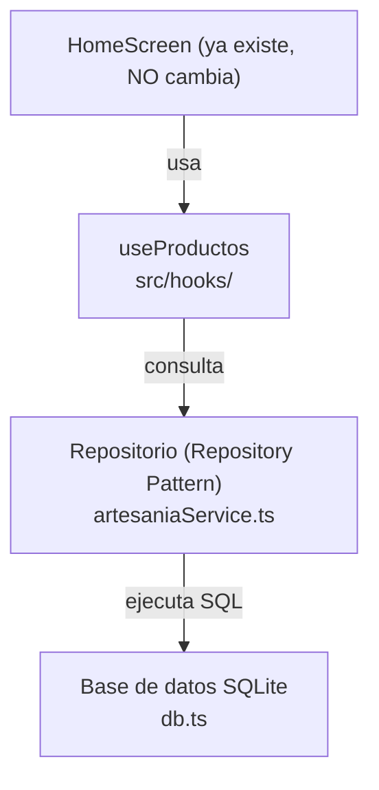
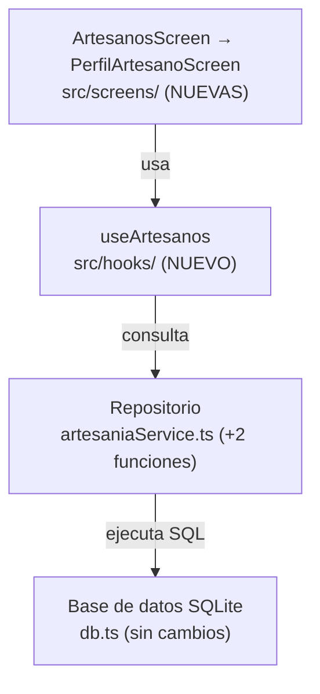
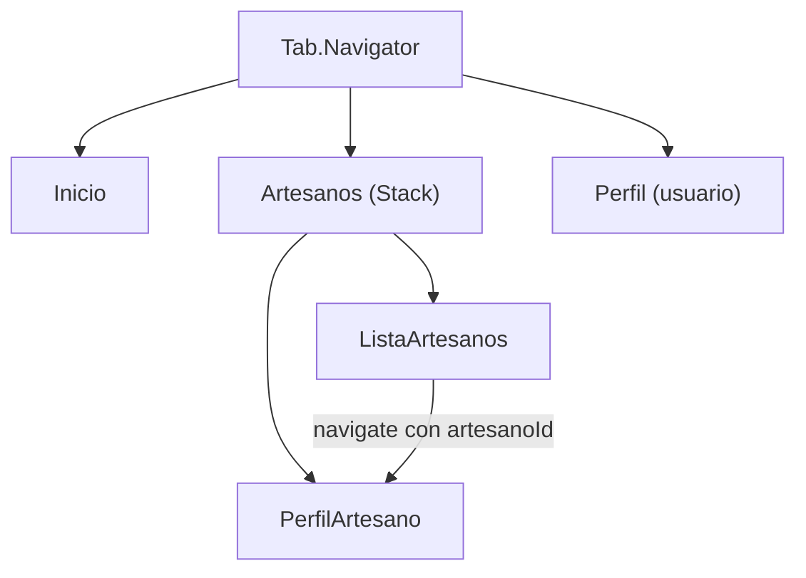

# Artisan Auction — Proyecto Integrador

**Programación Móvil · Universidad Politécnica de Querétaro · Mayo–Agosto 2026**
Ingeniería en Sistemas Computacionales · 9.° Cuatrimestre

---

## Descripción

Aplicación móvil de subastas de artesanías mexicanas desarrollada en React Native con Expo. El proyecto demuestra la implementación de patrones de diseño profesionales aplicados a una app funcional que consume datos de artesanos y productos en subasta.

---

## Tecnologías

- React Native
- Expo SDK 54
- TypeScript
- React Navigation v6

---

## Requisitos previos

- Node.js instalado
- Expo Go instalado en el celular (versión SDK 54)
- VS Code

---

## Instalación

```bash
git clone https://github.com/BOWadapter/PM.git
cd PM
npm install
npx expo start --clear
```

Escanea el QR con Expo Go desde tu celular.

---

## Estructura del proyecto

```
mi-proyecto-nuevo/
├── App.tsx                     ← Navegación principal
├── index.ts                    ← Punto de entrada
├── src/
│   ├── screens/
│   │   ├── HomeScreen.tsx      ← Lista de subastas con interacción
│   │   └── PerfilScreen.tsx    ← Perfil del usuario
│   ├── components/             ← (próximamente)
│   ├── services/
│   │   └── artesaniaService.ts ← Datos de artesanos y productos
│   ├── hooks/
│   │   └── useProductos.ts     ← Custom Hook de carga de datos
│   └── types/
│       └── index.ts            ← Tipos TypeScript del dominio
├── assets/
├── package.json
└── tsconfig.json
```

---

## Patrones de diseño implementados

### 1. Separation of Concerns

Cada carpeta tiene una única responsabilidad:

| Carpeta | Responsabilidad |
|---|---|
| `screens/` | Mostrar la interfaz al usuario |
| `services/` | Proveer y centralizar los datos |
| `types/` | Definir las estructuras de datos |
| `components/` | Piezas visuales reutilizables |
| `hooks/` | Lógica reutilizable entre pantallas |

### 2. Repository Pattern

`artesaniaService.ts` centraliza todos los datos en un solo lugar. Cuando conectemos la API real, solo modificamos este archivo y el resto de la app no cambia.

### 3. Custom Hooks

`useProductos.ts` encapsula la lógica de obtención de datos y el estado de carga, separándola de la pantalla. `HomeScreen` ya no sabe de dónde vienen los datos: solo consume el hook. Cuando se conecte la API real, únicamente cambia el hook.

---

## Tipos TypeScript — `src/types/index.ts`

```ts
export type Artesano = {
  id: number;
  nombre: string;
  especialidad: string;
  imagen: string;
  ubicacion: string;
};

export type Producto = {
  id: number;
  nombre: string;
  descripcion: string;
  imagen: string;
  precioInicial: number;
  precioActual: number;
  artesanoId: number;
  fechaFin: string;
};

export type Oferta = {
  id: number;
  productoId: number;
  usuarioId: number;
  monto: number;
  fecha: string;
};
```

---

## Datos de prueba — `src/services/artesaniaService.ts`

```ts
import { Artesano, Producto } from '../types/index';

export const artesanos: Artesano[] = [
  {
    id: 1,
    nombre: 'María López',
    especialidad: 'Cerámica Talavera',
    imagen: 'https://picsum.photos/id/1011/200',
    ubicacion: 'Puebla, México',
  },
  {
    id: 2,
    nombre: 'Juan Méndez',
    especialidad: 'Textiles Otomí',
    imagen: 'https://picsum.photos/id/1012/200',
    ubicacion: 'Querétaro, México',
  },
  {
    id: 3,
    nombre: 'Rosa Hernández',
    especialidad: 'Alebrijes',
    imagen: 'https://picsum.photos/id/1013/200',
    ubicacion: 'Oaxaca, México',
  },
];

export const productos: Producto[] = [
  {
    id: 1,
    nombre: 'Jarrón Talavera Azul',
    descripcion: 'Jarrón hecho a mano con técnica tradicional de Talavera.',
    imagen: 'https://picsum.photos/id/200/300',
    precioInicial: 500,
    precioActual: 650,
    artesanoId: 1,
    fechaFin: '2026-07-01',
  },
  {
    id: 2,
    nombre: 'Mantel Bordado Otomí',
    descripcion: 'Mantel con bordado a mano con motivos de la cultura Otomí.',
    imagen: 'https://picsum.photos/id/201/300',
    precioInicial: 800,
    precioActual: 950,
    artesanoId: 2,
    fechaFin: '2026-07-05',
  },
  {
    id: 3,
    nombre: 'Alebrije Dragón',
    descripcion: 'Figura de madera pintada a mano representando un dragón.',
    imagen: 'https://picsum.photos/id/202/300',
    precioInicial: 1200,
    precioActual: 1200,
    artesanoId: 3,
    fechaFin: '2026-07-10',
  },
];
```

---

## Custom Hook — `src/hooks/useProductos.ts`

```ts
import { useState, useEffect } from 'react';
import { productos as productosMock, artesanos } from '../services/artesaniaService';
import { Producto, Artesano } from '../types/index';

export function useProductos() {
  const [productos, setProductos] = useState<Producto[]>([]);
  const [cargando, setCargando] = useState<boolean>(true);

  useEffect(() => {
    setProductos(productosMock);
    setCargando(false);
  }, []);

  const getArtesano = (artesanoId: number): Artesano | undefined => {
    return artesanos.find(a => a.id === artesanoId);
  };

  return { productos, cargando, getArtesano };
}
```

---

## Pantalla principal — `src/screens/HomeScreen.tsx`

```tsx
import { View, Text, StyleSheet, FlatList, Image, TouchableOpacity, Alert, ActivityIndicator } from 'react-native';
import { useProductos } from '../hooks/useProductos';
import { Producto } from '../types/index';

export default function HomeScreen() {
  const { productos, cargando, getArtesano } = useProductos();

  const handleOfertar = (producto: Producto) => {
    const nuevaOferta = producto.precioActual + 100;
    Alert.alert(
      'Confirmar oferta',
      `¿Deseas ofertar $${nuevaOferta} por ${producto.nombre}?`,
      [
        { text: 'Cancelar', style: 'cancel' },
        { text: 'Ofertar', onPress: () => Alert.alert('Oferta enviada', `Tu oferta de $${nuevaOferta} fue registrada.`) },
      ]
    );
  };

  const renderProducto = ({ item }: { item: Producto }) => {
    const artesano = getArtesano(item.artesanoId);
    return (
      <View style={styles.card}>
        <Image source={{ uri: item.imagen }} style={styles.imagen} />
        <View style={styles.info}>
          <Text style={styles.nombre}>{item.nombre}</Text>
          <Text style={styles.artesano}>{artesano?.nombre} · {artesano?.ubicacion}</Text>
          <Text style={styles.descripcion}>{item.descripcion}</Text>
          <View style={styles.precios}>
            <Text style={styles.precioLabel}>Precio actual:</Text>
            <Text style={styles.precio}>${item.precioActual}</Text>
          </View>
          <Text style={styles.fecha}>Cierra: {item.fechaFin}</Text>
          <TouchableOpacity style={styles.boton} onPress={() => handleOfertar(item)}>
            <Text style={styles.botonTexto}>Hacer oferta +$100</Text>
          </TouchableOpacity>
        </View>
      </View>
    );
  };

  if (cargando) {
    return (
      <View style={styles.centrado}>
        <ActivityIndicator size="large" color="#3b82f6" />
        <Text style={styles.cargandoTexto}>Cargando subastas...</Text>
      </View>
    );
  }

  return (
    <View style={styles.container}>
      <FlatList
        data={productos}
        keyExtractor={item => item.id.toString()}
        renderItem={renderProducto}
        contentContainerStyle={styles.lista}
      />
    </View>
  );
}

const styles = StyleSheet.create({
  container: { flex: 1, backgroundColor: '#f5f5f5' },
  centrado: { flex: 1, alignItems: 'center', justifyContent: 'center', backgroundColor: '#f5f5f5' },
  cargandoTexto: { marginTop: 12, fontSize: 14, color: '#666' },
  lista: { padding: 16, gap: 16 },
  card: { backgroundColor: '#fff', borderRadius: 12, overflow: 'hidden', elevation: 3 },
  imagen: { width: '100%', height: 180 },
  info: { padding: 12, gap: 6 },
  nombre: { fontSize: 18, fontWeight: 'bold', color: '#1a1a1a' },
  artesano: { fontSize: 13, color: '#888' },
  descripcion: { fontSize: 14, color: '#555' },
  precios: { flexDirection: 'row', alignItems: 'center', gap: 8, marginTop: 4 },
  precioLabel: { fontSize: 14, color: '#555' },
  precio: { fontSize: 20, fontWeight: 'bold', color: '#3b82f6' },
  fecha: { fontSize: 12, color: '#aaa' },
  boton: { backgroundColor: '#3b82f6', borderRadius: 8, paddingVertical: 10, alignItems: 'center', marginTop: 8 },
  botonTexto: { color: '#fff', fontWeight: 'bold', fontSize: 15 },
});
```

---

## Navegación — `App.tsx`

```tsx
import { NavigationContainer } from '@react-navigation/native';
import { createBottomTabNavigator } from '@react-navigation/bottom-tabs';
import { Text } from 'react-native';
import HomeScreen from './src/screens/HomeScreen';
import PerfilScreen from './src/screens/PerfilScreen';

const Tab = createBottomTabNavigator();

export default function App() {
  return (
    <NavigationContainer>
      <Tab.Navigator>
        <Tab.Screen
          name="Inicio"
          component={HomeScreen}
          options={{ tabBarIcon: () => <Text>🏠</Text> }}
        />
        <Tab.Screen
          name="Perfil"
          component={PerfilScreen}
          options={{ tabBarIcon: () => <Text>👤</Text> }}
        />
      </Tab.Navigator>
    </NavigationContainer>
  );
}
```

---

## Componentes React Native utilizados

| Componente | Función |
|---|---|
| `FlatList` | Lista optimizada que solo renderiza elementos visibles |
| `TouchableOpacity` | Interacción táctil con retroalimentación visual |
| `Alert` | Diálogos nativos de confirmación |
| `Image` | Carga de imágenes desde URL |
| `ActivityIndicator` | Spinner de carga mientras se obtienen los datos |


# Custom Hooks en React Native

**Programación Móvil · Universidad Politécnica de Querétaro · Mayo–Agosto 2026**

---

## ¿Qué es un Custom Hook?

Un Custom Hook es una función de JavaScript cuyo nombre empieza con `use` y que permite **reutilizar lógica de estado** entre varios componentes. En lugar de repetir el mismo código (cargar datos, manejar un estado de carga, calcular valores) en cada pantalla, ese comportamiento se extrae a una función independiente que cualquier componente puede invocar.

Es importante entender que un Custom Hook **no devuelve interfaz** (no retorna JSX): devuelve datos y funciones. La pantalla se encarga de mostrar; el hook se encarga de la lógica.

---

## ¿Por qué usarlos?

En el proyecto Artisan Auction, la pantalla `HomeScreen` originalmente importaba los datos directamente y se encargaba de todo: obtener los productos, buscar el artesano de cada uno y mostrarlos. Esto mezcla dos responsabilidades distintas en un solo archivo.

Al mover la lógica de datos a un Custom Hook conseguimos:

- **Separación de responsabilidades:** la pantalla solo muestra; el hook gestiona los datos.
- **Reutilización:** si otra pantalla necesita los mismos productos, llama al mismo hook.
- **Mantenibilidad:** cuando se conecte la API real, solo se modifica el hook, no las pantallas.
- **Legibilidad:** la pantalla queda más corta y fácil de leer.

---

## Implementación — `src/hooks/useProductos.ts`

```ts
import { useState, useEffect } from 'react';
import { productos as productosMock, artesanos } from '../services/artesaniaService';
import { Producto, Artesano } from '../types/index';

export function useProductos() {
  const [productos, setProductos] = useState<Producto[]>([]);
  const [cargando, setCargando] = useState<boolean>(true);

  useEffect(() => {
    setProductos(productosMock);
    setCargando(false);
  }, []);

  const getArtesano = (artesanoId: number): Artesano | undefined => {
    return artesanos.find(a => a.id === artesanoId);
  };

  return { productos, cargando, getArtesano };
}
```

---

## Análisis del código

El hook utiliza dos Hooks nativos de React:

**`useState`** crea variables de estado. Aquí se declaran dos: `productos` (la lista que se mostrará, inicia vacía) y `cargando` (un booleano que indica si los datos aún se están obteniendo, inicia en `true`). Cada vez que se actualiza un estado con su función `set`, el componente que usa el hook se vuelve a renderizar.

**`useEffect`** ejecuta código en momentos específicos del ciclo de vida del componente. El arreglo vacío `[]` al final indica que el efecto se ejecuta **una sola vez**, cuando el componente se monta. Dentro se cargan los datos de prueba y se cambia `cargando` a `false`. Más adelante, este es el punto donde se hará la petición a la API real.

**`getArtesano`** es una función auxiliar que, dado el `artesanoId` de un producto, devuelve el objeto completo del artesano. Se incluye en el hook porque es lógica relacionada con los datos.

Finalmente, el hook **retorna un objeto** con `productos`, `cargando` y `getArtesano`. Eso es lo que la pantalla recibirá al llamarlo.

---

## Uso en la pantalla

La pantalla consume el hook con una sola línea, usando desestructuración:

```tsx
const { productos, cargando, getArtesano } = useProductos();
```

A partir de ahí, `HomeScreen` ya no sabe de dónde vienen los datos ni cómo se cargan. Solo los usa. Además, aprovecha el estado `cargando` para mostrar un indicador mientras los datos no están listos:

```tsx
if (cargando) {
  return (
    <View style={styles.centrado}>
      <ActivityIndicator size="large" color="#3b82f6" />
      <Text>Cargando subastas...</Text>
    </View>
  );
}
```

---

## Reglas de los Hooks

Para que los Hooks funcionen correctamente, React establece dos reglas:

1. **Solo se llaman en el nivel superior** de un componente o de otro Hook. Nunca dentro de condicionales, bucles o funciones anidadas.
2. **Solo se llaman desde componentes de React o desde otros Custom Hooks.** No desde funciones de JavaScript comunes.

La convención del prefijo `use` no es decorativa: es lo que permite a las herramientas de desarrollo verificar que estas reglas se cumplan.

---

## Conexión con los patrones de diseño del proyecto

Este Custom Hook es la tercera pieza del esquema de patrones del proyecto Artisan Auction:

| Patrón | Archivo | Responsabilidad |
|---|---|---|
| Separation of Concerns | estructura `src/` | Cada carpeta una responsabilidad |
| Repository Pattern | `services/artesaniaService.ts` | Centralizar el origen de los datos |
| Custom Hooks | `hooks/useProductos.ts` | Encapsular la lógica de datos y estado |

Juntos logran que la capa de datos, la lógica y la presentación estén separadas, que es el objetivo de una arquitectura mantenible.

---
# Conexión a base de datos SQLite

**Programación Móvil (UPQDPEFO002) · Universidad Politécnica de Querétaro**
**Periodo Mayo–Agosto 2026 · Unidad II — Diseño de aplicaciones móviles**
**Proyecto integrador: Artisan Auction · React Native + Expo SDK 54**

> **Parte 1 de 2.** Aquí conectamos la base de datos SQLite a la app que ya tienes, **sin agregar pantallas nuevas**. En la **Parte 2** construiremos encima el módulo de Artesanos.

---

## 1. ¿Qué vamos a hacer?

Hasta ahora los datos de la app vivían **en memoria** (arreglos dentro de `artesaniaService.ts`). Eso significa que no hay forma real de guardarlos: solo existen mientras la app está abierta.

En esta parte le damos **persistencia** conectando una base de datos **SQLite local** en el dispositivo con `expo-sqlite`. Al terminar, la pantalla de Inicio se verá **idéntica**, pero la lista de productos saldrá de una base de datos real en lugar de un arreglo. Todavía **no** creamos pantallas nuevas.

---

## 2. Arquitectura (la parte que tocamos)

La app se organiza en capas donde **cada capa solo conoce a la de abajo**. En esta parte trabajamos las tres capas inferiores; la pantalla de Inicio ya existe y no se modifica.



> **Regla de oro:** una pantalla nunca toca SQLite directamente. Pide los datos a un hook, el hook al repositorio, y solo el repositorio sabe que por debajo hay una base de datos. Gracias a esto, cambiar la fuente de datos (de arreglos a SQLite) **no obliga a tocar `HomeScreen`**.

---

## 3. Archivos que tocamos en esta parte

```
src/
├── database/
│   └── db.ts                  ← NUEVO: conexión + esquema + datos semilla
├── services/
│   └── artesaniaService.ts    ← MODIFICADO: ahora consulta SQLite (repositorio)
└── hooks/
    └── useProductos.ts        ← MODIFICADO: lee desde SQLite (misma API pública)
```

---

## 4. Dependencia

```powershell
npx expo install expo-sqlite
```

> Usa **`npx expo install`** (no `npm install`) para que Expo instale la versión compatible con el SDK 54. Todavía **NO** instalamos `native-stack`; eso es de la Parte 2.

---

## 5. Pasos

### Paso 1 — Conexión y esquema SQLite

Crea `src/database/db.ts`. Aquí vive la conexión, la creación de las tablas y los **datos semilla** (los mismos que antes eran mock). La base de datos se abre **una sola vez** gracias a una promesa memorizada.

```ts
// src/database/db.ts
import * as SQLite from 'expo-sqlite';
import { Artesano, Producto } from '../types/index';

// ── Datos semilla (los mismos que ya teníamos como mock) ───────────────
const artesanosSemilla: Artesano[] = [
  { id: 1, nombre: 'María López',    especialidad: 'Cerámica Talavera', imagen: 'https://picsum.photos/id/1011/200', ubicacion: 'Puebla, México' },
  { id: 2, nombre: 'Juan Méndez',    especialidad: 'Textiles Otomí',    imagen: 'https://picsum.photos/id/1012/200', ubicacion: 'Querétaro, México' },
  { id: 3, nombre: 'Rosa Hernández', especialidad: 'Alebrijes',         imagen: 'https://picsum.photos/id/1013/200', ubicacion: 'Oaxaca, México' },
];

const productosSemilla: Producto[] = [
  { id: 1, nombre: 'Jarrón Talavera Azul', descripcion: 'Jarrón hecho a mano con técnica tradicional de Talavera.', imagen: 'https://picsum.photos/id/200/300', precioInicial: 500,  precioActual: 650,  artesanoId: 1, fechaFin: '2026-07-01' },
  { id: 2, nombre: 'Mantel Bordado Otomí', descripcion: 'Mantel con bordado a mano con motivos de la cultura Otomí.', imagen: 'https://picsum.photos/id/201/300', precioInicial: 800,  precioActual: 950,  artesanoId: 2, fechaFin: '2026-07-05' },
  { id: 3, nombre: 'Alebrije Dragón',      descripcion: 'Figura de madera pintada a mano representando un dragón.',  imagen: 'https://picsum.photos/id/202/300', precioInicial: 1200, precioActual: 1400, artesanoId: 3, fechaFin: '2026-07-08' },
];

// Promesa única: la BD se abre y prepara UNA sola vez en toda la app
let dbPromise: Promise<SQLite.SQLiteDatabase> | null = null;

export function getDatabase(): Promise<SQLite.SQLiteDatabase> {
  if (!dbPromise) {
    dbPromise = inicializar();
  }
  return dbPromise;
}

async function inicializar(): Promise<SQLite.SQLiteDatabase> {
  const db = await SQLite.openDatabaseAsync('artisan_auction.db');
  await crearTablas(db);
  await sembrarDatos(db);
  return db;
}

async function crearTablas(db: SQLite.SQLiteDatabase): Promise<void> {
  await db.execAsync(`
    PRAGMA journal_mode = WAL;
    PRAGMA foreign_keys = ON;

    CREATE TABLE IF NOT EXISTS artesanos (
      id           INTEGER PRIMARY KEY NOT NULL,
      nombre       TEXT    NOT NULL,
      especialidad TEXT,
      imagen       TEXT,
      ubicacion    TEXT
    );

    CREATE TABLE IF NOT EXISTS productos (
      id            INTEGER PRIMARY KEY NOT NULL,
      nombre        TEXT    NOT NULL,
      descripcion   TEXT,
      imagen        TEXT,
      precioInicial REAL,
      precioActual  REAL,
      artesanoId    INTEGER REFERENCES artesanos(id),
      fechaFin      TEXT
    );

    CREATE TABLE IF NOT EXISTS ofertas (
      id         INTEGER PRIMARY KEY AUTOINCREMENT,
      productoId INTEGER REFERENCES productos(id),
      usuarioId  INTEGER,
      monto      REAL,
      fecha      TEXT
    );
  `);
}

async function sembrarDatos(db: SQLite.SQLiteDatabase): Promise<void> {
  // Si ya hay artesanos, no volvemos a sembrar
  const fila = await db.getFirstAsync<{ total: number }>(
    'SELECT COUNT(*) AS total FROM artesanos'
  );
  if ((fila?.total ?? 0) > 0) return;

  for (const a of artesanosSemilla) {
    await db.runAsync(
      'INSERT INTO artesanos (id, nombre, especialidad, imagen, ubicacion) VALUES (?, ?, ?, ?, ?)',
      a.id, a.nombre, a.especialidad, a.imagen, a.ubicacion
    );
  }

  for (const p of productosSemilla) {
    await db.runAsync(
      'INSERT INTO productos (id, nombre, descripcion, imagen, precioInicial, precioActual, artesanoId, fechaFin) VALUES (?, ?, ?, ?, ?, ?, ?, ?)',
      p.id, p.nombre, p.descripcion, p.imagen, p.precioInicial, p.precioActual, p.artesanoId, p.fechaFin
    );
  }
}
```

**Qué aprender aquí:**
- `openDatabaseAsync` abre (o crea) el archivo de la base de datos.
- `execAsync` ejecuta varias sentencias SQL de golpe (ideal para crear tablas).
- `PRAGMA foreign_keys = ON` activa las llaves foráneas: `productos.artesanoId` apunta a `artesanos.id`.
- `sembrarDatos` solo inserta si la tabla está vacía, para no duplicar.
- Creamos también la tabla `ofertas` desde ahora, lista para un futuro módulo de pujas (todavía no se usa).

> Si tu producto 3 tenía valores distintos, copia los tuyos al arreglo `productosSemilla`.

### Paso 2 — Repositorio (Repository Pattern)

`artesaniaService.ts` deja de tener arreglos y pasa a ser el **repositorio**: el único archivo que sabe consultar SQLite. En esta parte solo necesitamos las funciones de productos y de artesanos que usa `useProductos`.

```ts
// src/services/artesaniaService.ts
import { getDatabase } from '../database/db';
import { Artesano, Producto } from '../types/index';

// ── Artesanos ──────────────────────────────────────────────────────────
export async function obtenerArtesanos(): Promise<Artesano[]> {
  const db = await getDatabase();
  return db.getAllAsync<Artesano>('SELECT * FROM artesanos ORDER BY nombre');
}

// ── Productos ──────────────────────────────────────────────────────────
export async function obtenerProductos(): Promise<Producto[]> {
  const db = await getDatabase();
  return db.getAllAsync<Producto>('SELECT * FROM productos');
}
```

**Qué aprender aquí:**
- `getAllAsync<T>(sql)` devuelve un arreglo de filas tipado como `T[]`.
- En la Parte 2 le agregaremos a este mismo archivo dos funciones más (para buscar un artesano y sus productos).

### Paso 3 — Hook de productos (actualizar)

El hook ahora lee de SQLite, pero **expone exactamente la misma API** (`productos`, `cargando`, `getArtesano`). Por eso `HomeScreen.tsx` no cambia.

```ts
// src/hooks/useProductos.ts
import { useState, useEffect } from 'react';
import { obtenerProductos, obtenerArtesanos } from '../services/artesaniaService';
import { Producto, Artesano } from '../types/index';

export function useProductos() {
  const [productos, setProductos] = useState<Producto[]>([]);
  const [artesanos, setArtesanos] = useState<Artesano[]>([]);
  const [cargando, setCargando] = useState<boolean>(true);

  useEffect(() => {
    let activo = true; // evita actualizar estado si el componente se desmonta
    (async () => {
      const [prods, arts] = await Promise.all([obtenerProductos(), obtenerArtesanos()]);
      if (activo) {
        setProductos(prods);
        setArtesanos(arts);
        setCargando(false);
      }
    })();
    return () => { activo = false; };
  }, []);

  const getArtesano = (artesanoId: number): Artesano | undefined =>
    artesanos.find(a => a.id === artesanoId);

  return { productos, cargando, getArtesano };
}
```

**Qué aprender aquí:**
- `Promise.all` lanza las dos consultas en paralelo (más rápido que una tras otra).
- La bandera `activo` evita actualizar el estado de un componente que el usuario ya cerró.

> Si VS Code marca un error de importación de `artesanos`/`productos`, es el `useProductos` viejo que estás reemplazando; al guardar este nuevo, el error desaparece.

---

## 6. Probar

```powershell
npx expo start --clear
```

Verifica en el celular:

- [ ] La pantalla de **Inicio** se ve **idéntica** a como estaba.
- [ ] La lista de productos aparece sin errores (ahora viene de SQLite, no del arreglo).

Si la lista carga bien, la conexión ya funciona. Sube los cambios:

```powershell
git add .
git commit -m "feat: conexion a base de datos SQLite con expo-sqlite"
git push origin main
```

> Si el `push` se rechaza porque el remoto tiene commits que no están en local, ejecuta primero `git pull origin main` y vuelve a empujar.

---

## 7. Conceptos clave

- **API asíncrona de `expo-sqlite`:** `openDatabaseAsync`, `execAsync`, `getAllAsync`, `getFirstAsync` y `runAsync`. Todas devuelven promesas, por eso usamos `async/await`.
- **Persistencia:** una vez sembrada, la base de datos **vive en el dispositivo** y sobrevive a reinicios de la app.
- **Llaves foráneas (`artesanoId`):** relacionan un producto con su artesano.
- **Repository Pattern:** el repositorio es el único que sabe consultar la base; mañana podríamos cambiar SQLite por una API en la nube tocando solo esa capa.
- **Custom Hooks:** separan la lógica de datos de la interfaz; por eso la pantalla no cambió.
- **Re-sembrado:** como `sembrarDatos` solo inserta si la tabla está vacía, si cambias los datos semilla **no se reflejarán** hasta que desinstales la app (o borres su almacenamiento) y la vuelvas a abrir.

---

## 8. Siguiente

Cuando confirmes que **Inicio funciona desde SQLite**, continúa con la **Parte 2 — Módulo "Perfil de Artesano"**, donde agregaremos la pestaña de Artesanos con su lista y perfil.

---

#  Módulo "Perfil de Artesano"

**Programación Móvil (UPQDPEFO002) · Universidad Politécnica de Querétaro**
**Periodo Mayo–Agosto 2026 · Unidad II — Diseño de aplicaciones móviles**
**Proyecto integrador: Artisan Auction · React Native + Expo SDK 54**

> **Parte 2 de 2.** Requiere haber completado la **Parte 1 — Conexión a base de datos SQLite** (la app debe correr leyendo datos desde SQLite). Aquí construimos encima el módulo de Artesanos.

---

## 1. ¿Qué vamos a hacer?

Sobre la base de la Parte 1, agregamos un **módulo nuevo**: una pestaña **Artesanos** que muestra la lista de artesanos y, al tocar uno, abre su **perfil** con las piezas que tiene en subasta. De paso aprendemos **navegación tipo Stack anidada** dentro de una pestaña.

---

## 2. Requisito previo

Antes de empezar, confirma que la **Parte 1 está completa**:

- [ ] Existe `src/database/db.ts` con la conexión y el sembrado.
- [ ] `src/services/artesaniaService.ts` ya es el repositorio (consulta SQLite).
- [ ] `src/hooks/useProductos.ts` lee desde SQLite y la pantalla de Inicio funciona.

La tabla `artesanos` ya quedó sembrada en la Parte 1, así que aquí solo agregamos consultas y pantallas.

---

## 3. Arquitectura (lo nuevo)

Las pantallas nuevas siguen la misma regla: hablan con un hook, el hook con el repositorio, y el repositorio con SQLite.



**Navegación:** la pestaña **Artesanos** contendrá un **Stack** con dos pantallas (Lista → Perfil), para poder navegar y regresar dentro de la misma pestaña.



---

## 4. Archivos que tocamos en esta parte

```
src/
├── services/
│   └── artesaniaService.ts        ← MODIFICADO: +2 funciones de artesano
├── hooks/
│   └── useArtesanos.ts            ← NUEVO: lista y detalle de artesanos
├── screens/
│   ├── ArtesanosScreen.tsx        ← NUEVO: lista de artesanos
│   └── PerfilArtesanoScreen.tsx   ← NUEVO: perfil del artesano + sus piezas
├── types/
│   └── navigation.ts              ← NUEVO: tipos de navegación
└── App.tsx                        ← MODIFICADO: pestaña "Artesanos" con Stack anidado
```

---

## 5. Dependencia

```powershell
npx expo install "@react-navigation/native-stack@^6.0.0"
```

> `native-stack` reutiliza `react-native-screens` y `react-native-safe-area-context`, que ya tenías instalados para las pestañas.

---

## 6. Pasos

### Paso 1 — Agregar dos funciones al repositorio

Abre `src/services/artesaniaService.ts` y agrega las dos funciones marcadas como NUEVAS. Tu archivo completo queda así:

```ts
// src/services/artesaniaService.ts
import { getDatabase } from '../database/db';
import { Artesano, Producto } from '../types/index';

// ── Artesanos ──────────────────────────────────────────────────────────
export async function obtenerArtesanos(): Promise<Artesano[]> {
  const db = await getDatabase();
  return db.getAllAsync<Artesano>('SELECT * FROM artesanos ORDER BY nombre');
}

// NUEVO (Parte 2): un artesano por su id
export async function obtenerArtesanoPorId(id: number): Promise<Artesano | null> {
  const db = await getDatabase();
  return db.getFirstAsync<Artesano>('SELECT * FROM artesanos WHERE id = ?', id);
}

// ── Productos ──────────────────────────────────────────────────────────
export async function obtenerProductos(): Promise<Producto[]> {
  const db = await getDatabase();
  return db.getAllAsync<Producto>('SELECT * FROM productos');
}

// NUEVO (Parte 2): los productos de un artesano
export async function obtenerProductosPorArtesano(artesanoId: number): Promise<Producto[]> {
  const db = await getDatabase();
  return db.getAllAsync<Producto>(
    'SELECT * FROM productos WHERE artesanoId = ?',
    artesanoId
  );
}
```

**Qué aprender aquí:**
- `getFirstAsync<T>(sql, param)` devuelve la primera fila o `null`.
- El `?` es un **parámetro**: nunca concatenes valores directo en el SQL.

### Paso 2 — Hook de artesanos (nuevo)

Dos hooks: uno para la lista y otro para un artesano con sus productos.

```ts
// src/hooks/useArtesanos.ts
import { useState, useEffect } from 'react';
import {
  obtenerArtesanos,
  obtenerArtesanoPorId,
  obtenerProductosPorArtesano,
} from '../services/artesaniaService';
import { Artesano, Producto } from '../types/index';

// Hook para la LISTA de artesanos
export function useArtesanos() {
  const [artesanos, setArtesanos] = useState<Artesano[]>([]);
  const [cargando, setCargando] = useState<boolean>(true);

  useEffect(() => {
    let activo = true;
    (async () => {
      const datos = await obtenerArtesanos();
      if (activo) { setArtesanos(datos); setCargando(false); }
    })();
    return () => { activo = false; };
  }, []);

  return { artesanos, cargando };
}

// Hook para UN artesano + sus productos en subasta
export function useArtesano(id: number) {
  const [artesano, setArtesano] = useState<Artesano | null>(null);
  const [productos, setProductos] = useState<Producto[]>([]);
  const [cargando, setCargando] = useState<boolean>(true);

  useEffect(() => {
    let activo = true;
    (async () => {
      const [a, p] = await Promise.all([
        obtenerArtesanoPorId(id),
        obtenerProductosPorArtesano(id),
      ]);
      if (activo) { setArtesano(a); setProductos(p); setCargando(false); }
    })();
    return () => { activo = false; };
  }, [id]);

  return { artesano, productos, cargando };
}
```

**Qué aprender aquí:** el segundo hook recibe un `id` y lo pone en las dependencias de `useEffect` (`[id]`). Si el `id` cambia, vuelve a consultar.

### Paso 3 — Tipos de navegación

```ts
// src/types/navigation.ts
export type ArtesanosStackParamList = {
  ListaArtesanos: undefined;
  PerfilArtesano: { artesanoId: number };
};
```

**Qué aprender aquí:** este tipo describe qué pantallas hay en el Stack y qué parámetros recibe cada una. `PerfilArtesano` exige un `artesanoId` de tipo `number`, y TypeScript nos avisa si navegamos mal.

### Paso 4 — Pantalla lista de artesanos

```tsx
// src/screens/ArtesanosScreen.tsx
import { View, Text, StyleSheet, FlatList, Image, TouchableOpacity, ActivityIndicator } from 'react-native';
import { NativeStackScreenProps } from '@react-navigation/native-stack';
import { useArtesanos } from '../hooks/useArtesanos';
import { Artesano } from '../types/index';
import { ArtesanosStackParamList } from '../types/navigation';

type Props = NativeStackScreenProps<ArtesanosStackParamList, 'ListaArtesanos'>;

export default function ArtesanosScreen({ navigation }: Props) {
  const { artesanos, cargando } = useArtesanos();

  if (cargando) {
    return (
      <View style={styles.centrado}>
        <ActivityIndicator size="large" />
        <Text>Cargando artesanos...</Text>
      </View>
    );
  }

  const renderArtesano = ({ item }: { item: Artesano }) => (
    <TouchableOpacity
      style={styles.card}
      onPress={() => navigation.navigate('PerfilArtesano', { artesanoId: item.id })}
    >
      <Image source={{ uri: item.imagen }} style={styles.avatar} />
      <View style={styles.info}>
        <Text style={styles.nombre}>{item.nombre}</Text>
        <Text style={styles.especialidad}>{item.especialidad}</Text>
        <Text style={styles.ubicacion}>📍 {item.ubicacion}</Text>
      </View>
      <Text style={styles.flecha}>›</Text>
    </TouchableOpacity>
  );

  return (
    <FlatList
      data={artesanos}
      keyExtractor={(item) => item.id.toString()}
      renderItem={renderArtesano}
      contentContainerStyle={styles.lista}
    />
  );
}

const styles = StyleSheet.create({
  centrado: { flex: 1, justifyContent: 'center', alignItems: 'center', gap: 8 },
  lista: { padding: 12 },
  card: {
    flexDirection: 'row', alignItems: 'center', backgroundColor: '#fff',
    borderRadius: 12, padding: 12, marginBottom: 10, elevation: 2,
  },
  avatar: { width: 56, height: 56, borderRadius: 28, marginRight: 12 },
  info: { flex: 1 },
  nombre: { fontSize: 16, fontWeight: 'bold' },
  especialidad: { color: '#555' },
  ubicacion: { color: '#888', fontSize: 12, marginTop: 2 },
  flecha: { fontSize: 26, color: '#bbb' },
});
```

**Qué aprender aquí:** al tocar una tarjeta, `navigation.navigate('PerfilArtesano', { artesanoId: item.id })` abre la siguiente pantalla y le pasa el `id` del artesano como parámetro.

### Paso 5 — Pantalla perfil del artesano

Usa `ListHeaderComponent` para mostrar la ficha del artesano arriba y debajo su lista de piezas en subasta.

```tsx
// src/screens/PerfilArtesanoScreen.tsx
import { View, Text, StyleSheet, FlatList, Image, ActivityIndicator } from 'react-native';
import { NativeStackScreenProps } from '@react-navigation/native-stack';
import { useArtesano } from '../hooks/useArtesanos';
import { Producto } from '../types/index';
import { ArtesanosStackParamList } from '../types/navigation';

type Props = NativeStackScreenProps<ArtesanosStackParamList, 'PerfilArtesano'>;

export default function PerfilArtesanoScreen({ route }: Props) {
  const { artesanoId } = route.params;
  const { artesano, productos, cargando } = useArtesano(artesanoId);

  if (cargando) {
    return <View style={styles.centrado}><ActivityIndicator size="large" /></View>;
  }
  if (!artesano) {
    return <View style={styles.centrado}><Text>Artesano no encontrado.</Text></View>;
  }

  const renderProducto = ({ item }: { item: Producto }) => (
    <View style={styles.producto}>
      <Image source={{ uri: item.imagen }} style={styles.productoImg} />
      <View style={styles.productoInfo}>
        <Text style={styles.productoNombre}>{item.nombre}</Text>
        <Text style={styles.precio}>Puja actual: ${item.precioActual}</Text>
        <Text style={styles.cierre}>Cierra: {item.fechaFin}</Text>
      </View>
    </View>
  );

  return (
    <FlatList
      data={productos}
      keyExtractor={(item) => item.id.toString()}
      renderItem={renderProducto}
      ListHeaderComponent={
        <View style={styles.header}>
          <Image source={{ uri: artesano.imagen }} style={styles.avatarGrande} />
          <Text style={styles.nombre}>{artesano.nombre}</Text>
          <Text style={styles.especialidad}>{artesano.especialidad}</Text>
          <Text style={styles.ubicacion}>📍 {artesano.ubicacion}</Text>
          <Text style={styles.subtitulo}>Piezas en subasta ({productos.length})</Text>
        </View>
      }
      ListEmptyComponent={<Text style={styles.vacio}>Este artesano no tiene piezas en subasta.</Text>}
      contentContainerStyle={styles.lista}
    />
  );
}

const styles = StyleSheet.create({
  centrado: { flex: 1, justifyContent: 'center', alignItems: 'center' },
  lista: { padding: 12 },
  header: { alignItems: 'center', paddingVertical: 16 },
  avatarGrande: { width: 100, height: 100, borderRadius: 50, marginBottom: 10 },
  nombre: { fontSize: 20, fontWeight: 'bold' },
  especialidad: { color: '#555', marginTop: 2 },
  ubicacion: { color: '#888', marginTop: 2 },
  subtitulo: { alignSelf: 'flex-start', fontSize: 16, fontWeight: 'bold', marginTop: 18, marginBottom: 6 },
  producto: { flexDirection: 'row', backgroundColor: '#fff', borderRadius: 12, padding: 10, marginBottom: 10, elevation: 2 },
  productoImg: { width: 70, height: 70, borderRadius: 8, marginRight: 12 },
  productoInfo: { flex: 1, justifyContent: 'center' },
  productoNombre: { fontSize: 15, fontWeight: 'bold' },
  precio: { color: '#2e7d32', marginTop: 2 },
  cierre: { color: '#888', fontSize: 12, marginTop: 2 },
  vacio: { textAlign: 'center', color: '#888', marginTop: 20 },
});
```

**Qué aprender aquí:** `route.params.artesanoId` recupera el parámetro que envió la pantalla anterior. Ese `id` alimenta al hook `useArtesano`, que trae al artesano y sus productos en una sola carga.

### Paso 6 — Navegación (App.tsx)

Agrega el Stack anidado y la pestaña nueva. Si ya tenías títulos o íconos personalizados, consérvalos: lo nuevo son las 3 importaciones de `native-stack`, la función `ArtesanosStack` y la pestaña **Artesanos**.

```tsx
// App.tsx
import { Text } from 'react-native';
import { NavigationContainer } from '@react-navigation/native';
import { createBottomTabNavigator } from '@react-navigation/bottom-tabs';
import { createNativeStackNavigator } from '@react-navigation/native-stack';

import HomeScreen from './src/screens/HomeScreen';
import PerfilScreen from './src/screens/PerfilScreen';           // perfil del usuario (ya existente)
import ArtesanosScreen from './src/screens/ArtesanosScreen';
import PerfilArtesanoScreen from './src/screens/PerfilArtesanoScreen';
import { ArtesanosStackParamList } from './src/types/navigation';

const Tab = createBottomTabNavigator();
const Stack = createNativeStackNavigator<ArtesanosStackParamList>();

// Stack anidado para el módulo de Artesanos
function ArtesanosStack() {
  return (
    <Stack.Navigator>
      <Stack.Screen name="ListaArtesanos" component={ArtesanosScreen} options={{ title: 'Artesanos' }} />
      <Stack.Screen name="PerfilArtesano" component={PerfilArtesanoScreen} options={{ title: 'Perfil del artesano' }} />
    </Stack.Navigator>
  );
}

export default function App() {
  return (
    <NavigationContainer>
      <Tab.Navigator screenOptions={{ headerShown: false }}>
        <Tab.Screen
          name="Inicio"
          component={HomeScreen}
          options={{ headerShown: true, tabBarIcon: () => <Text>🏠</Text> }}
        />
        <Tab.Screen
          name="ArtesanosTab"
          component={ArtesanosStack}
          options={{ title: 'Artesanos', tabBarIcon: () => <Text>🎨</Text> }}
        />
        <Tab.Screen
          name="Perfil"
          component={PerfilScreen}
          options={{ headerShown: true, tabBarIcon: () => <Text>👤</Text> }}
        />
      </Tab.Navigator>
    </NavigationContainer>
  );
}
```

**Qué aprender aquí:** un **Stack dentro de una pestaña** permite que "Artesanos" tenga navegación interna (lista → perfil → regresar). Es un patrón muy común en apps reales.

---

## 7. Probar

```powershell
npx expo start --clear
```

Verifica en el celular:

- [ ] Aparece la pestaña **Artesanos** con la lista de los 3 artesanos.
- [ ] Al tocar un artesano se abre su **perfil** con sus piezas en subasta.
- [ ] El botón de regresar funciona dentro de la pestaña Artesanos.
- [ ] La pestaña **Inicio** sigue funcionando igual que en la Parte 1.

Sube los cambios:

```powershell
git add .
git commit -m "feat: modulo Perfil de Artesano con navegacion Stack anidada"
git push origin main
```

---

## 8. Conceptos clave

- **Parámetros de ruta (`route.params`):** así se pasan datos de una pantalla a otra (aquí, el `artesanoId`).
- **Stack anidado en Tabs:** una pestaña puede contener su propio navegador para tener historial (avanzar/regresar) interno.
- **`useEffect` con dependencias (`[id]`):** el hook vuelve a consultar cuando cambia el `id`.
- **`ListHeaderComponent`:** muestra una cabecera fija (la ficha del artesano) arriba de una `FlatList`.

---

## 9. Reto para el alumno (opcional)

1. **Módulo de Ofertas:** crear funciones en el repositorio para insertar una puja en la tabla `ofertas` y actualizar el `precioActual` del producto.
2. **Contador en la lista:** mostrar junto a cada artesano cuántas piezas tiene en subasta (consulta con `COUNT(*)` agrupado por `artesanoId`).
3. **Buscar artesanos:** agregar un cuadro de búsqueda que filtre por nombre o especialidad usando `WHERE nombre LIKE ?`.


# Parte 3 — Servicios REST y Notificaciones

**Proyecto:** Artisan Auction (`mi-proyecto-nuevo`)
**Unidad II · 2.3 Servicios y notificaciones en aplicaciones móviles**
**Prerrequisito:** SQLite conectado y módulo Artesanos funcionando (Parte 1 y Parte 2).

---

# SECCIÓN A — Marco conceptual

## A.1 Fase 1: Consumo de servicios REST

### El modelo cliente-servidor

Hasta ahora la app es **autocontenida**: los datos viven en SQLite, dentro del dispositivo. Eso funciona, pero tiene un límite fundamental: *los datos de un usuario no existen para los demás*. En una app de subastas eso es fatal — si un comprador oferta desde su teléfono, el artesano nunca se entera.

La solución es el modelo **cliente-servidor**: los datos se centralizan en un servidor remoto y los clientes (cada instancia de la app) se comunican con él mediante un protocolo común. Ese protocolo es **HTTP**, y el estilo arquitectónico que organiza esa comunicación es **REST** (Representational State Transfer). REST descansa en tres ideas:

1. **Recursos identificados por URL**: `/api/artesanos/5` no es "una función", es la representación del artesano con id 5.
2. **Verbos HTTP con semántica fija**: `GET` lee, `POST` crea, `PUT` actualiza, `DELETE` elimina. El mismo recurso, distintas operaciones — mapea 1:1 con el CRUD que ya se implementó en SQLite.
3. **Sin estado (stateless)**: cada petición lleva toda la información necesaria; el servidor no "recuerda" al cliente entre peticiones. Esto es lo que después justifica el uso de JWT: como el servidor no guarda sesión, el cliente debe presentar su credencial en cada petición.

### Por qué la interfaz común importa más que axios

El punto central de la fase **no es hacer un `fetch`**. Es el **principio de inversión de dependencias** (la "D" de SOLID): el Hook no debe depender de una implementación concreta (SQLite o API), sino de una **abstracción** (`IArtesanoRepository`).

La consecuencia práctica es demostrable: se cambia una línea en el `RepositoryFactory` y toda la app pasa de datos locales a datos remotos **sin tocar ni una pantalla ni un Hook**. Esa es la evidencia de que la arquitectura por capas construida desde la Parte 1 no era burocracia — era preparación para este momento.

### Asincronía y los tres estados

Diferencia técnica clave respecto a SQLite:

- **SQLite es local**: latencia de milisegundos, prácticamente nunca falla.
- **HTTP es red**: latencia impredecible (cientos de ms o segundos) y **falla con frecuencia** (sin señal, servidor caído, timeout).

Por eso el Hook debe modelar explícitamente tres estados: `loading`, `error`, `success`. Conceptualmente: **la red es un recurso no confiable** y una app profesional nunca asume que la petición va a llegar. Técnicamente:

- `axios.get<Artesano[]>()` devuelve una **Promise** — la petición sale, JavaScript sigue ejecutando, y el resultado llega "después". `async/await` es azúcar sintáctica sobre eso.
- El genérico `<Artesano[]>` es el contrato TypeScript: le dice al compilador qué forma esperamos del JSON. Advertencia: es una *promesa del programador*, no una validación en runtime — si el servidor devuelve otra cosa, TypeScript no salva a nadie.
- El `try/catch/finally` garantiza que `loading` siempre se apague, incluso en fallo. El error de novato clásico es un spinner infinito porque el `setLoading(false)` estaba solo en el camino feliz.

## A.2 Fase 2: Notificaciones locales

### Comunicación proactiva y ciclo de vida de la app

Todo lo construido hasta ahora es **reactivo**: la app responde cuando el usuario la abre y toca algo. Las notificaciones invierten esa relación — la app **toma la iniciativa** y le habla al usuario aunque esté cerrada. Es el rasgo que distingue a una app móvil de una página web: la capacidad de existir fuera de la sesión activa.

Dos tipos que no deben confundirse:

| | Notificación **local** | Notificación **push** |
|---|---|---|
| Origen | La propia app, en el dispositivo | Un servidor remoto |
| Infraestructura | Ninguna adicional | FCM (Google) / APNs (Apple) + backend |
| Ejemplo en Artisan Auction | "Tu subasta guardada cierra en 5 min" | "Alguien superó tu oferta" |
| Alcance de esta práctica | ✅ Esta fase | ❌ Extensión futura |

El caso de uso elegido ("avísame cuando la subasta esté por cerrar") es deliberadamente local: el dato (fecha de cierre) ya está en el dispositivo, así que la app calcula el momento y **delega el aviso al sistema operativo**. Ese es el concepto técnico clave: la app no queda "esperando en segundo plano" (Android la mataría) — le entrega la tarea al SO, que sí vive siempre.

### Permisos como contrato con el usuario

Desde Android 13, las notificaciones son un **permiso en tiempo de ejecución**, igual que cámara o ubicación. El principio de diseño detrás: el usuario es dueño de su atención, y el SO actúa como intermediario que protege ese recurso. Una app que no verifica el permiso antes de programar la notificación no falla ruidosamente — la notificación simplemente nunca llega, que es el peor tipo de bug: silencioso.

Flujo obligatorio: `requestPermissionsAsync()` → verificar `status === 'granted'` → solo entonces `scheduleNotificationAsync()`.

### Las tres piezas de expo-notifications

1. **El handler** (`setNotificationHandler`): define qué pasa si la notificación llega *con la app abierta*. Sin él, en foreground no se muestra nada y parece que "no funciona".
2. **El scheduling** (`scheduleNotificationAsync`): recibe `content` (título y cuerpo, con datos dinámicos del modelo) y un `trigger` (segundos calculados a partir de `fechaCierre`). El cálculo `fechaCierre − ahora − 5 minutos` es un micro-ejercicio de fechas: timestamps en ms, conversión a segundos, y el caso borde de resultado negativo (subasta ya cerrada → no programar nada).
3. **El SO como ejecutor**: una vez programada, la notificación sobrevive al cierre de la app. Es el sistema operativo quien la dispara — por eso la prueba exige cerrar la app y esperar.

## A.3 El hilo que une ambas fases

Las dos fases cubren el subtema **2.3 Servicios y notificaciones** y comparten una idea: la app deja de ser una isla. La Fase 1 la conecta con *otros sistemas* (el servidor); la Fase 2 la conecta con *el usuario ausente* (a través del SO). En términos de la competencia de la asignatura, es el paso de "desarrollar una aplicación" a "integrar una solución": la app ahora participa en un ecosistema — servidor, sistema operativo, otros usuarios — en lugar de vivir sola en un teléfono.

---

# SECCIÓN B — Implementación paso a paso

## B.1 Fase 1 — Consumo de servicios REST

### Paso 1: Instalar dependencias

```powershell
cd C:\Users\adx\Documents\Dev\PM\mi-proyecto-nuevo
npx expo install axios
npm install -g json-server
```

### Paso 2: Definir la interfaz común del Repository

```typescript
// src/types/IArtesanoRepository.ts
import { Artesano } from './Artesano';

export interface IArtesanoRepository {
  getAll(): Promise<Artesano[]>;
  getById(id: number): Promise<Artesano | null>;
  create(artesano: Omit<Artesano, 'id'>): Promise<number>;
  update(id: number, artesano: Partial<Artesano>): Promise<void>;
  delete(id: number): Promise<void>;
}
```

Ajustar el Repository de SQLite existente para que la implemente:

```typescript
// src/services/ArtesanoRepository.ts
export class ArtesanoRepository implements IArtesanoRepository {
  // ... implementación existente con expo-sqlite
}
```

### Paso 3: Crear el Repository que consume la API

```typescript
// src/services/ArtesanoRepositoryAPI.ts
import axios from 'axios';
import { Artesano } from '../types/Artesano';
import { IArtesanoRepository } from '../types/IArtesanoRepository';

const API_URL = 'http://localhost:3000/api/artesanos'; // ajustar cuando backend-pm esté verificado

export class ArtesanoRepositoryAPI implements IArtesanoRepository {
  async getAll(): Promise<Artesano[]> {
    const { data } = await axios.get<Artesano[]>(API_URL);
    return data;
  }

  async getById(id: number): Promise<Artesano | null> {
    try {
      const { data } = await axios.get<Artesano>(`${API_URL}/${id}`);
      return data;
    } catch {
      return null;
    }
  }

  async create(artesano: Omit<Artesano, 'id'>): Promise<number> {
    const { data } = await axios.post<{ id: number }>(API_URL, artesano);
    return data.id;
  }

  async update(id: number, artesano: Partial<Artesano>): Promise<void> {
    await axios.put(`${API_URL}/${id}`, artesano);
  }

  async delete(id: number): Promise<void> {
    await axios.delete(`${API_URL}/${id}`);
  }
}
```

> **Nota:** si `backend-pm` aún no tiene `/health` verificado, usar temporalmente `json-server` con un `db.json` de artesanos para no bloquear la práctica, y cambiar `API_URL` cuando el backend esté listo.
> **Nota Android:** desde el dispositivo físico, `localhost` apunta al teléfono, no a la PC. Usar la IP local de la máquina de desarrollo (p. ej. `http://192.168.x.x:3000`), visible con `ipconfig`.

### Paso 4: Actualizar el Hook con estados explícitos

```typescript
// src/hooks/useArtesanos.ts
import { useState, useEffect } from 'react';
import { Artesano } from '../types/Artesano';
import { IArtesanoRepository } from '../types/IArtesanoRepository';

export function useArtesanos(repository: IArtesanoRepository) {
  const [artesanos, setArtesanos] = useState<Artesano[]>([]);
  const [loading, setLoading] = useState(true);
  const [error, setError] = useState<string | null>(null);

  const cargar = async () => {
    setLoading(true);
    setError(null);
    try {
      const data = await repository.getAll();
      setArtesanos(data);
    } catch (err) {
      setError('No se pudo conectar con el servicio. Intenta más tarde.');
    } finally {
      setLoading(false);
    }
  };

  useEffect(() => {
    cargar();
  }, []);

  return { artesanos, loading, error, recargar: cargar };
}
```

### Paso 5: Reflejar los estados en la pantalla

```tsx
// src/screens/ArtesanosScreen.tsx (fragmento)
if (loading) return <ActivityIndicator size="large" style={{ flex: 1 }} />;
if (error) return <Text style={{ textAlign: 'center', margin: 20 }}>{error}</Text>;
```

### Paso 6: Factory para intercambiar la fuente de datos

```typescript
// src/services/RepositoryFactory.ts
import { ArtesanoRepository } from './ArtesanoRepository';
import { ArtesanoRepositoryAPI } from './ArtesanoRepositoryAPI';

const USE_API = true; // false para volver a SQLite local

export const artesanoRepository = USE_API
  ? new ArtesanoRepositoryAPI()
  : new ArtesanoRepository();
```

## B.2 Fase 2 — Notificaciones locales

### Paso 1: Instalar

```powershell
npx expo install expo-notifications expo-device expo-constants
```

### Paso 2: Configurar el manejador y los permisos

```typescript
// src/services/NotificationService.ts
import * as Notifications from 'expo-notifications';

Notifications.setNotificationHandler({
  handleNotification: async () => ({
    shouldShowAlert: true,
    shouldPlaySound: true,
    shouldSetBadge: false,
  }),
});

export async function solicitarPermisos(): Promise<boolean> {
  const { status } = await Notifications.requestPermissionsAsync();
  return status === 'granted';
}
```

### Paso 3: Programar la notificación con datos reales

```typescript
// src/services/NotificationService.ts (continúa)
export async function programarNotificacionCierre(
  productoNombre: string,
  fechaCierre: Date
) {
  const segundosRestantes = Math.floor((fechaCierre.getTime() - Date.now()) / 1000);
  if (segundosRestantes <= 0) return; // subasta ya cerrada: no programar

  await Notifications.scheduleNotificationAsync({
    content: {
      title: `¡Subasta de "${productoNombre}" por cerrar!`,
      body: 'Quedan menos de 5 minutos para que termine la subasta.',
    },
    trigger: { seconds: Math.max(segundosRestantes - 300, 5) },
  });
}
```

### Paso 4: Usarlo en la pantalla de detalle

```tsx
// src/screens/DetalleProductoScreen.tsx (fragmento)
useEffect(() => {
  (async () => {
    const permitido = await solicitarPermisos();
    if (permitido && producto.fechaCierre) {
      await programarNotificacionCierre(producto.nombre, new Date(producto.fechaCierre));
    }
  })();
}, [producto]);
```

### Paso 5: Probar en dispositivo físico

- Android 13+: confirmar que aparece el diálogo de permiso al abrir la pantalla.
- Cerrar la app y esperar el trigger — Expo Go debe mostrar la notificación en la barra del sistema.
- Si no aparece: revisar que `fechaCierre` sea un dato real del modelo, no un valor de prueba en el pasado.

## B.3 Control de versiones

```powershell
git add .
git commit -m "feat: consumo de servicios REST con interfaz Repository intercambiable"
git commit -m "feat: notificaciones locales de cierre de subasta con expo-notifications"
git push origin main
```

---

# SECCIÓN C — Actividad para alumnos

## ACTIVIDAD — SERVICIOS REST Y NOTIFICACIONES
**Unidad II · Individual, sobre el proyecto integrador**

### OBJETIVO
Conectar la capa Repository de su app (hoy solo habla con SQLite) a un servicio HTTP externo, y agregar una notificación local basada en datos reales del proyecto.

### FASE 1 — Consumo de servicios REST
1. Instalen el cliente HTTP: `npx expo install axios` (o `fetch` nativo, sin instalación).
2. Creen una clase que implemente **la misma interfaz** que su Repository de SQLite. El Hook no debe enterarse de si los datos vienen de SQLite o de una API.
3. En el Hook, manejen tres estados explícitos: `loading`, `error`, `success`.
4. Muestren `ActivityIndicator` durante la carga y un mensaje claro si falla la petición (sin tumbar la app).

*Si su backend aún no está estable, usen una API mock (`json-server` local) para no bloquear el avance.*

**Requisitos:** interfaz común entre ambos repositorios · tipado TypeScript de la respuesta · manejo visible de los 3 estados en pantalla.

### FASE 2 — Notificaciones locales
1. `npx expo install expo-notifications`
2. Soliciten permiso de notificaciones (obligatorio en Android 13+).
3. Programen con `scheduleNotificationAsync` una notificación que avise cuando una subasta esté por cerrar, usando la fecha de cierre real del producto.
4. Título dinámico con el nombre del producto, cuerpo con el tiempo restante.

**Requisitos:** permisos verificados antes de programar · contenido dinámico del modelo, no texto fijo · prueba en dispositivo físico vía Expo Go.

### ENTREGABLE
- Repo en GitHub, **2 commits descriptivos** (uno por fase).
- Capturas: petición exitosa con datos remotos · pantalla de error simulado · notificación recibida.
- README con diagrama actualizado (`Screens → Hooks → Repository → [SQLite | API]`) y reflexión: ventajas/riesgos de tener dos fuentes de datos intercambiables y qué aprendieron sobre permisos.

### EVALUACIÓN
| Criterio | % |
|---|---|
| Fase 1 — Consumo de API con manejo de estados | 35% |
| Fase 1 — Interfaz común / arquitectura por capas | 15% |
| Fase 2 — Notificación funcional con datos dinámicos | 25% |
| Fase 2 — Manejo correcto de permisos | 10% |
| Documentación y reflexión | 15% |

---

# SECCIÓN D — Checklist de cierre de Unidad II

- [ ] `IArtesanoRepository` implementada por SQLite y por API sin cambiar los Hooks.
- [ ] Estados `loading` / `error` / `success` visibles en pantalla.
- [ ] Permiso de notificaciones solicitado y verificado.
- [ ] Notificación con título/cuerpo dinámico, no texto fijo.
- [ ] Capturas del flujo completo para el README.
- [ ] Diagrama actualizado: `Screens → Hooks → Repository → [SQLite | API]`.
- [ ] Commits descriptivos pusheados a `main`.

---
*Programación Móvil — Universidad Politécnica de Querétaro — Mayo–Agosto 2026*
